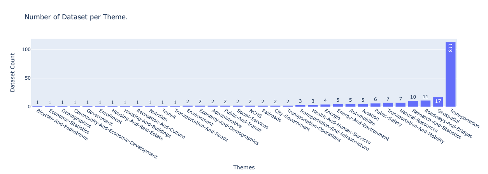
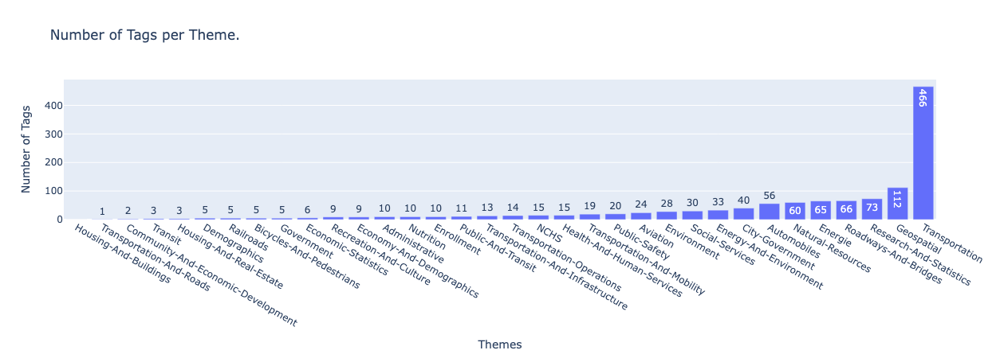

# tabular-data-to-business-glossaries-annotation-dataset
A dataset of tabular data from [data.gov](https://data.gov/) annotated to business glossaries using LLMs.

# 1. Dataset Description
Following a collaboration between [Zeenea](https://zeenea.com/fr/) and [LIP6](https://www.lip6.fr/) through an industrial thesis project on **Smart Metadata Management Systems**,
we encountered a number of data-related challenges.
Through this project, we took the initiative to build a relevant dataset for tabular data alignment with business glossaries.

This repository contains tabular data (datasets and columns) collected from [data.gov](https://data.gov/) , various business glossaries, and alignments between tabular data and business glossary entities.

We choose [data.gov](https://data.gov/) for the following reasons:
* Easy-to-use API
* A vast amount of public and open source data
* Tabular Datasets are annotated with _themes_ and a _list of tags_ 
* Tabular Columns have meaningful names 

The table bellow describes the main content of this repository:

| Content Description  |                                                        |
|----------------------|--------------------------------------------------------|
| data/                | Collection of tables in csv files                      |
| metadata/            | Metadata about Datasets, Columns, Themes and Tags      |
| business-glossaries/ | Collection of business-glossaries in csv files         |
| alignments/          | Column and Dataset alignments with business-glossaries |
| figures/             | Statistical figures                                    |

We used Large Language Models LLMs to assist the dataset construction as described bellow.

# 2. Dataset Construction
### 2.1. Data Collection and Preparation
We collected 226 Datasets (Tables) from [data.gov](https://data.gov/) using their API. 
We searched for datasets related to **Transport** field, the choice of the field was arbitrary.

The table bellow describes some statistics about columns and rows in the collected datasets:

| Statistics on datasets                |      |
|---------------------------------------|------|
| Number of datasets                    | 226  |
| Number of columns                     | 5232 |
| Maximum number of columns per dataset | 381  |
| Minimum number of columns per dataset | 2    |
| Mean number of columns per dataset    | 23   |
| Maximum number of rows per dataset    | 100  |
| Minimum number of rows per dataset    | 4    |
| Mean number of rows per dataset       | 62   |

Each dataset is described with metadata which consists of issuing organization ,dataset name, column names, list of tags, theme, access level and license.
* **_Dataset Theme._** It describes the general topic of the dataset
* **_Dataset Tags._** It represents a list of terms that are related to the dataset content

After a data cleaning process of the dataset themes and tag lists, we grouped together the tags per theme (the result is stored in [theme_to_tags_metadata.json](metadata/theme_to_tags_metadata.json)).
We obtained 34 Themes, and each theme has a list of tags.

#### Statistics on themes and tags
Distribution of datasets per theme:


Distribution of tags per theme:


### 2.2. LLM-Generated Business Glossaries

In this part, we use Large Language Models to generate business glossaries.
For our experiments, we used [mistralai/Mistral-7B-Instruct-v0.3](https://huggingface.co/mistralai/Mistral-7B-Instruct-v0.3) LLM.
For each theme, we give the LLM the list of corresponding tags as input. 
The LLM follows the instructions of the prompt and generates a hierarchy of business concepts in relation to the theme and list of tags.
The dataset theme is placed at the root of the generated hierarchy of business concepts.

The prompt used to generate the Business-Glossaries:

```
[
        {
            "role": "user",
            "content": "Generate in a json format, a hierarchical business glossary in the theme of Transportation, by creating concepts with descriptions linked together, using this list of tags: ['car', 'bolt', 'chevrolet', 'vehicle', 'green-report'].\
            The business glossary should contain business concepts with descriptions, instances and subclasses if needed.",
        },
        {
            "role": "assistant",
            "content": """{ 'Transportation': {
                                    'Vehicle': {
                                      'description': 'Any device capable of moving, and can be used for transportation.',
                                      'subclasses': {
                                        'Car': {
                                          'description': 'A road vehicle, typically with four wheels, powered by an internal combustion engine or electric motor.',
                                          'instances': ['bolt', 'chevrolet']
                                        }
                                      }
                                    },
                                    'Environmental-Agency': {
                                                            'description': 'Organization focused on environmental impacts.',
                                                            'instances': ['green-report']
                                                            }
          },
      }"""
        },
        {
            "role":"user",
            "content": f"Generate in a json format, a hierarchical business glossary in the theme of {theme}, by creating concepts with descriptions linked together, using this list of tags: {list_of_tags}. \
                        The business glossary should contain business concepts with descriptions, instances and subclasses if needed." 
        }
    ]
```

The table bellow describes some statistics on the LLM-generated Business Glossaries:

| Statistics on LLM-generated Business Glossaries |     |
|-------------------------------------------------|-----|
| Number of Business Glossaries                   | 34  |
| Maximum number of business entity per glossary  | 26  |
| Minimum number of business entity per glossary  | 4   |
| Mean number of business entity per glossary     | 14  |
| Maximum number of levels per glossary           | 9   |
| Minimum number of levels per glossary           | 2   |
| Mean number of levels per glossary              | 4   |

### 2.3. LLM-Generated Alignments
For the LLM-Generated Alignments, we use the same LLM as before [mistralai/Mistral-7B-Instruct-v0.3](https://huggingface.co/mistralai/Mistral-7B-Instruct-v0.3), but with another prompt.
For each dataset, we ask the LLM through the prompt to generate alignments between the dataset columns and the corresponding business glossary entities (each dataset has a theme, and each theme is linked to a business glossary).
Datasets are linked to the business concepts at the root of the generated hierarchies (represented by the themes).


The prompt used to generate the Alignments:
```
[
            {
                "role": "user",
                "content": "In a json format {column:business-concept}, generate alignments between these tabular columns: ['vehicle', 'model', 'environment'] and the next business glossary items: "+ """["Transportation\",
                            "Transportattion.Vehicle", "Transportation.Vehicle.Car", "Transportation.Vehicle.Car.Model", "Transportation.Environmental-Agency", "Transportation.Environmental-Agency.Environment", "Transportation.Environmental-Agency.Agency"]. """ \
                            + "Business concepts should contain the right path in the business glossary."
            },
            {
                "role": "assistant",
                "content":"""{
                "vehicle": "Transportation.Vehicle",
                "model": "Transportation.Vehicle.Car.Model",
                "environment": "Trasportation.Environmental-Agency"
                }"""

            },
            {
                "role":"user",
                "content": "In a json format {column-business-concept}, generate alignments between these tabular columns:"+ f"{list_columns} and the next business glossary items: {list_entities}. "\
                           +"Business concepts should contain the right path in the business glossary."
            }
        ]
```


The table bellow describes some statistics on the LLM-generated Alignments:

| Statistics on LLM-generated Alignments |        |
|----------------------------------------|--------|
| Number of aligned columns              | **1017**   |
| Rate of aligned columns                | **19.02%** |
| Number of aligned datasets             | **226**    |
| Rate of aligned datasets               | **100%**   |


# 3. License
tabular-data-to-business-glossaries-annotation-dataset © 2024 by Zeenea is licensed under CC BY-NC-SA 4.0.
To view a copy of this license, visit https://creativecommons.org/licenses/by-nc-sa/4.0/ or go to [LICENCE.md](/LICENSE.md).

Certain datasets utilized in this project are governed by specific licenses as detailed in [column_and_dataset_metadata.csv](/metadata/column_and_dataset_metadata.csv).  
The corresponding licenses are provided in [data.gov](https://data.gov/) for each dataset. 

The dataset licenses used in this project are:
* http://opendatacommons.org/licenses/odbl/1.0/
* https://creativecommons.org/licenses/by/4.0/
* https://www.usa.gov/government-works
* http://creativecommons.org/licenses/by/4.0/legalcode
* https://louisville-metro-opendata-lojic.hub.arcgis.com/pages/terms-of-use-and-license
* http://creativecommons.org/licenses/by-sa/4.0/legalcode
* http://creativecommons.org/publicdomain/zero/1.0/legalcode
* http://www.usa.gov/publicdomain/label/1.0/
* http://opendefinition.org/licenses/odc-odbl/
* https://creativecommons.org/licenses/by/4.0
* http://opendatacommons.org/licenses/pddl/1.0/
* https://logis.loudoun.gov/loudoun/disclaimer.html
* https://creativecommons.org/licenses/by-nc-nd/4.0
